# How to read this report

I built eleven machine-learning models to tell pancreatic tumour CT scans apart from normal ones. All of them scored between 98% and 100%.

Then I checked whether those scores were real. They were not.

This report explains, in order: what I built, what the results looked like, the three problems I found, and how I proved each one. Every number in it I computed myself by re-running the models I had saved — none of it is copied from the original training logs. The scripts that produce every figure and table are in the project folder and can be re-run.

If you only read one thing, read Section 5. That is where the project's actual finding is.

---

# 1. Background: what I was trying to do

Pancreatic cancer is one of the deadliest cancers, largely because it is usually found late. If a computer could flag suspicious pancreases on ordinary abdominal CT scans, more cases might be caught early. So there is a lot of published work training neural networks to do exactly this, and it usually reports accuracy above 95%.

My question was a comparison question:

> Given the same dataset and the same fair testing procedure, do modern **transformer** networks beat older **convolutional** networks at spotting pancreatic tumours? And is it better to retrain the whole network, or to freeze it and just train a simple classifier on top?

To answer that I needed several models trained identically, so that any difference between them came from the architecture and not from luck or setup.

## 1.1 A few terms, in plain language

Because this report will be read by people who are not deep-learning specialists, here is the vocabulary it uses.

| Term | What it means |
|:---|:---|
| **Training / validation / test split** | The data is cut into three parts. The model *learns* from the training part, is *tuned* on the validation part, and is *graded* on the test part, which it must never see while learning. |
| **Seed** | A random number that decides how the data gets shuffled and how the model starts. Running with five different seeds gives five different attempts, so you can see whether a result is real or luck. |
| **Accuracy** | Out of 100 test images, how many the model got right. |
| **Precision** | When the model says "tumour", how often it is correct. |
| **Recall (sensitivity)** | Out of all the real tumours, how many the model caught. In medicine this is the one that matters most — a missed tumour is far worse than a false alarm. |
| **Specificity** | Out of all the healthy scans, how many the model correctly left alone. |
| **F1 score** | Precision and recall combined into one number. |
| **Cohen's kappa (κ)** | Accuracy after removing the credit a model gets from lucky guessing. κ = 100% is perfect, κ = 0% means the model is no better than random. **This metric is what exposed the first problem.** |
| **AUROC** | How well the model *ranks* scans from least to most suspicious, ignoring where you set the cut-off. 100% means it ranks every tumour above every healthy scan. **This metric is what exposed the third problem.** |
| **Confusion matrix** | A 2×2 table showing exactly what the model got right and wrong: true negatives, false alarms, missed tumours, correct catches. |
| **Data leakage** | When information from the test set sneaks into training, so the "exam" contains questions the model already saw. Scores go up; real ability does not. |
| **Shortcut learning** | When a model solves a task using an irrelevant clue rather than the thing you wanted it to learn. |

---

# 2. The data

The dataset arrived as two folders, `train/` and `test/`, each split into `normal/` and `pancreatic_tumor/`.

| Folder | Normal | Pancreatic tumour | Total |
|:---|---:|---:|---:|
| `train/` | 421 | 578 | 999 |
| `test/` | 225 | 187 | 412 |
| **Total** | **646** | **765** | **1,411** |

Most images are 512×512 greyscale JPEGs — 964 of the 999 training images. The exceptions turn out to matter: 34 tumour images and one normal image are small colour JPEGs at odd sizes like 250×202 and 256×197.

One thing I should have questioned on day one and did not: **the class balance flips between the two folders.** `train/` is 42% normal, `test/` is 55% normal. Two folders assembled by the same process would not do that. That was the first clue, and I walked past it.

---

# 3. What I built

## 3.1 Track A — retrain the whole network (four models)

I took four networks that had already been trained on millions of everyday photographs (ImageNet), then continued training every layer of them on the CT scans. This is called **fine-tuning**: the network already knows about edges, textures and shapes, and only has to learn what a pancreatic tumour looks like.

| Model | Type | Framework | Input size | Learning rate |
|:---|:---|:---|:---|---:|
| **ResNet50** | Convolutional | TensorFlow / Keras | 224×224 | 1e-4 |
| **InceptionV3** | Convolutional | TensorFlow / Keras | 299×299 | 1e-4 |
| **MobileViT** | Convolution + transformer hybrid | PyTorch | 224×224 | 5e-5 |
| **Swin-Tiny** | Transformer | PyTorch | 224×224 | 5e-5 |

Each model was trained five separate times, on seeds 42, 7, 21, 99 and 123. Each run cut the 999 training-folder images into 799 for learning, 100 for tuning and 100 for the final grade. Every run used up to 25 epochs with early stopping, batch size 32, and the same augmentation (flips, rotation, brightness jitter, random cropping). All ± figures in this report are the spread across those five runs.

**I saved all 20 trained models.** That single decision is the reason everything in Section 4 was possible, and it is the most useful habit I picked up this summer.

## 3.2 Track B — freeze the network, train a simple classifier on top (fourteen pipelines)

Here I used two networks (Xception and DenseNet121) purely as *feature extractors*: I froze them completely, pushed each image through, and kept the numeric summary that came out the other side. Then I trained ordinary machine-learning classifiers on those summaries — support vector machine, random forest, AdaBoost, k-nearest neighbours, bagging, a small neural network, XGBoost, LSTM and Bi-LSTM.

This track trains on all 999 `train/` images and splits the 412 `test/` images in half — 206 for validation, 206 for the final grade.

## 3.3 Track C — build a transformer from scratch

I also implemented a Transformer and a Vision Transformer from nothing, in pure PyTorch: multi-head attention, positional encoding, encoder and decoder blocks, patch embedding, the classification token, the whole thing. The unit tests pass and the code is well documented.

But I never actually trained it on the CT data — the output folder the README refers to was never created. So this track is finished as code and unfinished as an experiment. It is the easiest remaining item to complete.

---

# 4. Problem 1 — a bug that made two models look terrible

## 4.1 How I noticed

When I put the results side by side, something was arithmetically impossible:

| Model | Accuracy | Precision | Recall | F1 | **Cohen's κ** |
|:---|---:|---:|---:|---:|---:|
| ResNet50 | 98.40% | 59.66% | 59.66% | 59.64% | **3.94%** |
| InceptionV3 | 98.20% | 58.43% | 58.62% | 58.51% | **1.00%** |

Cohen's κ near zero means *the model is guessing*. But accuracy of 98% means it is getting 98 out of 100 right. Both cannot be true at once. One of those numbers had to be wrong.

## 4.2 What was actually happening

Both TensorFlow scripts built every dataset — including the test set — through the same helper function, which ended with this line:

```python
ds = ds.shuffle(buffer_size=len(paths), seed=seed).batch(batch_size)
```

Shuffling the *training* set is correct and normal. Shuffling the *test* set is where it went wrong, because of what came next:

```python
y_prob = model.predict(test_ds).ravel()      # predictions come back SHUFFLED
prec   = precision_score(te_l, y_pred)       # labels are in the ORIGINAL order
```

Imagine grading an exam where you shuffle the answer sheets but not the answer key. You compare student 1's answers against student 37's key. Every score you compute is nonsense — but if you had already counted the total marks before shuffling, that total is still fine.

That is exactly what happened. `model.evaluate()` counts accuracy batch by batch, and each batch carries its own labels along with its own images, so accuracy was never affected. Everything computed afterwards from `model.predict()` was.

## 4.3 Confirming the diagnosis with arithmetic

Before touching any code I checked whether the numbers matched the theory. The test set has 58 tumours and 42 normals. A good model predicts roughly 59 tumours. If you scatter those 59 predictions at random across 100 slots of which 58 are really tumours, about 34 will land correctly by chance. That gives:

- precision ≈ 34 / 59 = **57.6%**
- recall ≈ 34 / 58 = **58.6%**
- κ ≈ **0**

The reported values were 57.6% to 65.5%. Exactly the chance band. The theory was right before I ran anything.

## 4.4 Fixing it

I wrote `reevaluate_fixed.py`, which reloads each saved model, rebuilds the identical data split, and makes predictions from a plain unshuffled array so predictions and labels cannot drift apart.

There was one risk: if my rebuilt split differed from the original in any way, I would be testing the models on images they had been trained on, and the "corrected" numbers would be worthless. So I built in a check. Accuracy was never corrupted by the bug, which makes it a fingerprint — if my recomputed accuracy matches the accuracy the original run recorded, I know I am looking at the same images.

**All ten model-and-seed combinations matched exactly.** The script is written to stop and warn loudly if they ever do not.

## 4.5 The result

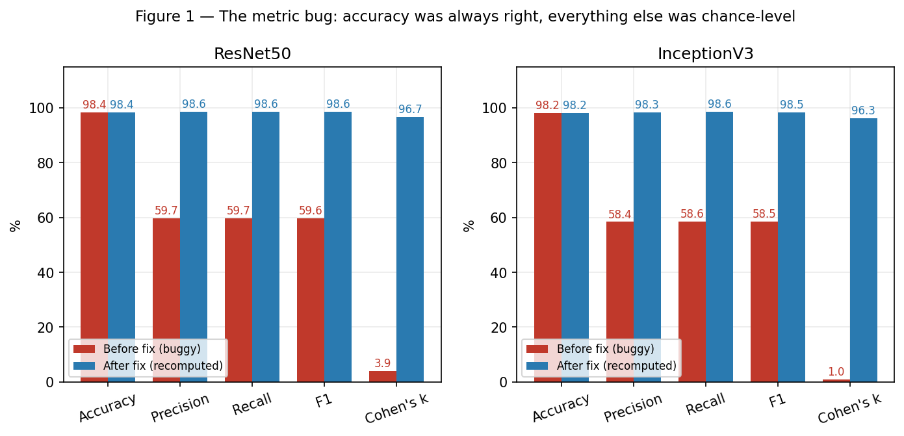{ width=100% }

| Model | Metric | Before fix | After fix |
|:---|:---|---:|---:|
| ResNet50 | Precision | 59.66% | **98.64%** |
| ResNet50 | Recall | 59.66% | **98.62%** |
| ResNet50 | F1 | 59.64% | **98.61%** |
| ResNet50 | Cohen's κ | 3.94% | **96.72%** |
| InceptionV3 | Precision | 58.43% | **98.32%** |
| InceptionV3 | Recall | 58.62% | **98.62%** |
| InceptionV3 | F1 | 58.51% | **98.45%** |
| InceptionV3 | Cohen's κ | 1.00% | **96.30%** |

Accuracy did not move at all, exactly as predicted.

**Why this mattered so much.** Before the fix, the results said transformers crushed convolutional networks — Swin and MobileViT at κ = 96.72% against ResNet50's 3.94%. That is a ninety-point gap and it would have been the headline of the whole project. After the fix, ResNet50 has κ = 96.72% too. The entire "transformers win" story was one misplaced `.shuffle()` call.

**What I take from this.** Some metrics constrain each other. On a two-class problem, if you know accuracy and you know the class balance, only a narrow range of κ values is possible. Checking that takes two minutes and would have caught this before I wrote a single result down.

## 4.6 Making sure every number here is mine

The bug affected only the two TensorFlow models. The PyTorch models (MobileViT, Swin) were safe by construction — their test loader uses `shuffle=False`, and more importantly they collect predictions and labels *in the same loop*, so the two can never fall out of step. That is the pattern I will use from now on.

Even so, I did not want to quote the original logs for those two. So I wrote a second script, `reevaluate_pytorch.py`, which rebuilds both architectures from scratch, loads my saved weights (zero missing keys, zero unexpected keys — the architectures match exactly), reproduces the preprocessing by hand, and recomputes everything. **All ten runs reproduced the originally logged accuracy exactly**, and I obtained specificity and AUROC, which the original scripts never recorded.

So: every figure in this report comes from a script I wrote and ran against my own saved models.

---

# 5. The corrected results — and why they still mean nothing

## 5.1 All four networks, recomputed by me

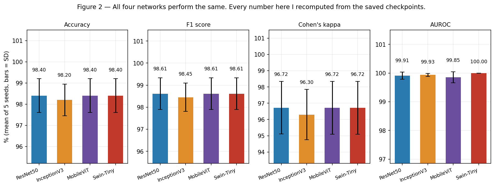{ width=100% }

| Model | Accuracy | Precision | Recall | Specificity | F1 | Cohen's κ | AUROC |
|:---|---:|---:|---:|---:|---:|---:|---:|
| ResNet50 | 98.40 ± 0.80 | 98.64 ± 0.68 | 98.62 ± 2.01 | 98.10 ± 0.95 | 98.61 ± 0.72 | 96.72 ± 1.62 | 99.91 ± 0.12 |
| InceptionV3 | 98.20 ± 0.75 | 98.32 ± 1.50 | 98.62 ± 1.29 | 97.62 ± 2.13 | 98.45 ± 0.64 | 96.30 ± 1.54 | 99.93 ± 0.06 |
| MobileViT | 98.40 ± 0.80 | 98.66 ± 1.25 | 98.62 ± 2.01 | 98.10 ± 1.78 | 98.61 ± 0.71 | 96.72 ± 1.62 | 99.85 ± 0.19 |
| Swin-Tiny | 98.40 ± 0.80 | 98.66 ± 1.25 | 98.62 ± 2.01 | 98.10 ± 1.78 | 98.61 ± 0.71 | 96.72 ± 1.62 | 100.00 ± 0.00 |

**There is no winner.** Three of the four have identical F1 and identical κ. The fourth is behind by 0.16 F1 points, which is a fifth of the run-to-run wobble. My original research question — do transformers beat convolutional networks here? — cannot be answered with this data, because the data cannot tell the four models apart.

Looking at the mistakes makes it obvious why.

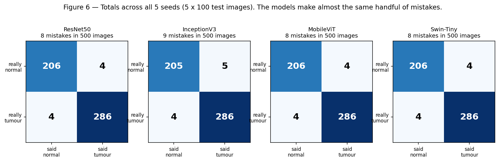{ width=100% }

Across all five seeds — 500 graded images per model — ResNet50, MobileViT and Swin each make **8 mistakes**, and InceptionV3 makes **9**. Largely the same images, too. When a whole model is decided by one or two pictures, no comparison is meaningful.

## 5.2 The training curves

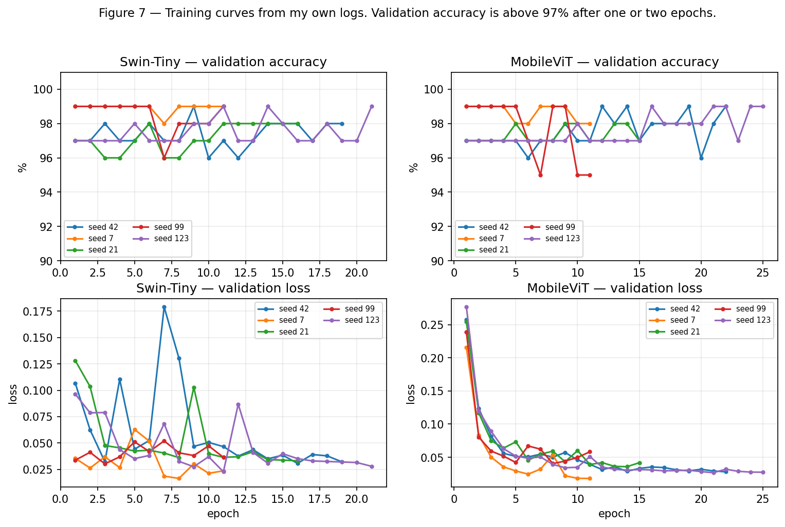{ width=100% }

Both PyTorch models are above 97% validation accuracy after **one epoch**. A model that solves a hard medical problem after seeing the data once has almost certainly found an easy way to cheat. At the time I read this as "transfer learning works really well." It was the second clue I walked past.

## 5.3 Track B: the classical classifiers

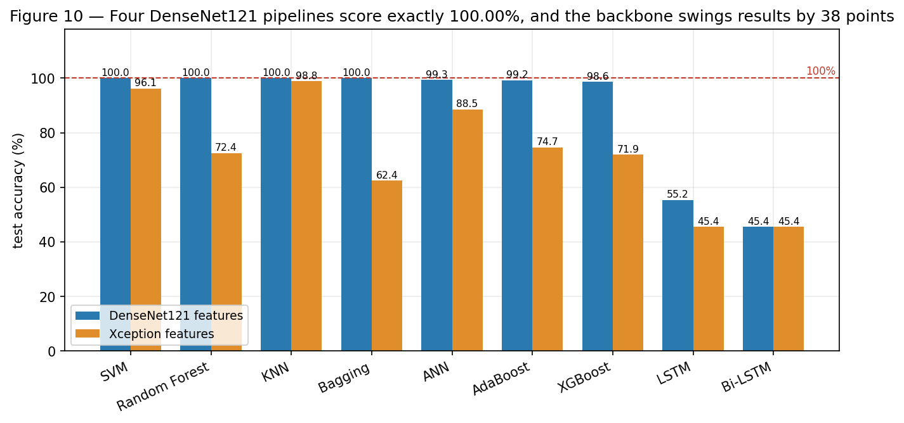{ width=100% }

| Classifier | On DenseNet121 features | On Xception features |
|:---|---:|---:|
| SVM | **100.00 ± 0.00** | 96.12 ± 1.27 |
| Random forest | **100.00 ± 0.00** | 72.43 ± 1.98 |
| k-NN | **100.00 ± 0.00** | 98.83 ± 0.24 |
| Bagging | **100.00 ± 0.00** | 62.43 ± 4.52 |
| Small neural net | 99.32 ± 0.95 | 88.54 ± 3.39 |
| AdaBoost | 99.22 ± 0.50 | 74.66 ± 2.28 |
| XGBoost | 98.64 ± 0.36 | 71.94 ± 1.21 |
| LSTM | 55.24 ± 19.71 | 45.44 ± 0.24 |
| Bi-LSTM | 45.44 ± 0.24 | 45.44 ± 0.24 |

Two things stand out.

**Four pipelines score exactly 100.00%, with zero variation across five seeds.** Nothing in medicine is perfect five times in a row. This is not a result; it is a warning light.

**Swapping the frozen network swings random forest by 27 points and bagging by 38.** Both are frozen ImageNet networks. If there were a genuine pancreatic signal in the images, changing which frozen network extracts it would not move the answer that far. Something much more fragile is being picked up.

**A note on LSTM and Bi-LSTM.** These did not fail because recurrent networks are bad — they failed because the pipeline hands them a single-timestep "sequence", which gives a recurrent layer nothing to work with. Both have κ = 0.00 and accuracy equal to the tumour proportion of the test set, meaning they predict the same class for every image. I am keeping them in the report as a useful negative control: they prove my measurement code correctly reports failure when a model actually fails.

---

# 6. Problem 2 — a fifth of the data is duplicated

## 6.1 The audit

Every image file has a **hash** — a short fingerprint computed from its bytes. Two files with the same hash are byte-for-byte identical. I hashed all 1,411 images.

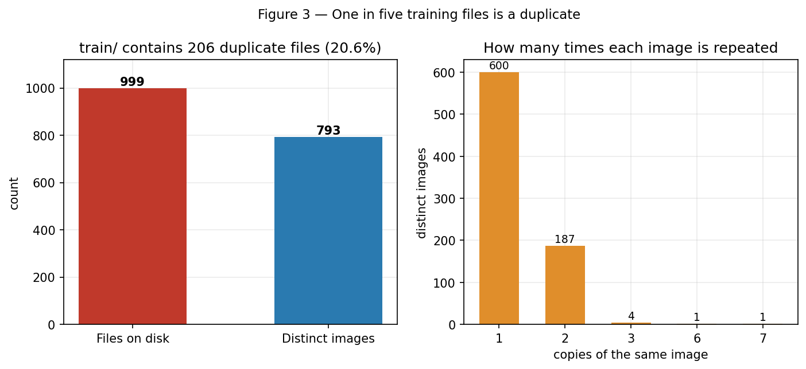{ width=100% }

| What I checked | Result |
|:---|---:|
| Files in `train/` | 999 |
| **Actually distinct images** | **793** |
| Duplicate copies | **206 (20.6%)** |
| Images filed under **both** class labels | **18 (36 files)** |
| `test/` images identical to a `train/` image | 8 |

Some images appear twice; one appears six times; one appears seven times.

The 18 label conflicts are the worst part. The exact same picture is filed as `normal` in one place and `pancreatic_tumor` in another. No model can be right about both, and it proves nobody checked the labels when the dataset was put together. Filenames like `images (8) - Copy - Copy - Copy - Copy - Copy - Copy.jpg` show how it happened: someone duplicated files by hand in a file manager.

## 6.2 What this does to every test score

The split is drawn over individual files, so the duplicates scatter across all three parts.

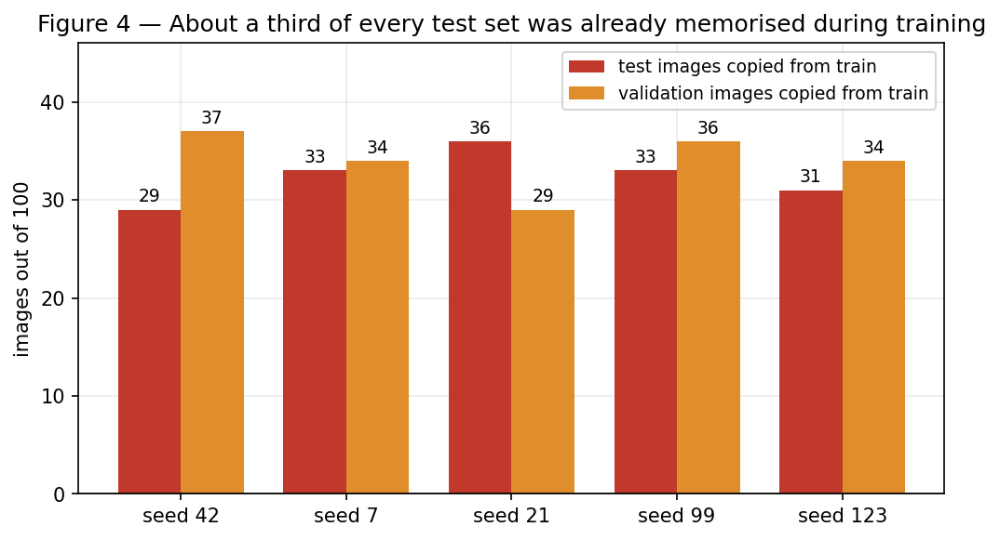{ width=100% }

| Seed | Test images that are exact copies of a training image | Validation images likewise |
|---:|---:|---:|
| 42 | 29 / 100 | 37 / 100 |
| 7 | 33 / 100 | 34 / 100 |
| 21 | 36 / 100 | 29 / 100 |
| 99 | 33 / 100 | 36 / 100 |
| 123 | 31 / 100 | 34 / 100 |

**About a third of every exam was made up of questions the model had already been shown, with the answers.**

And this is the *optimistic* count — it only catches files that are byte-identical. The filenames run in blocks (`1-001` to `1-239`, `22 (1)` to `22 (119)`, `23 (102)` onward), which is what consecutive slices from one CT scan look like. Two neighbouring slices through the same abdomen are nearly the same picture even when the files differ. Splitting by slice therefore puts the same patient on both sides of the exam.

The right unit to split on is the **patient**. This dataset ships no patient IDs, so a fair split cannot be built from what I have.

---

# 7. Problem 3 — the models are not looking at the pancreas

Problems 1 and 2 are fixable. This one is not.

## 7.1 The question I should have asked first

> Could something that has no idea what a pancreas looks like score just as well?

I measured seven completely trivial things about each image. Not shapes, not textures, not anatomy — just:

1. average brightness
2. how much the brightness varies
3. width in pixels
4. height in pixels
5. **the size of the file in bytes**
6. what fraction of pixels are very bright
7. what fraction of pixels are nearly black

Then I fitted a logistic regression — about the simplest classifier that exists — on those seven numbers.

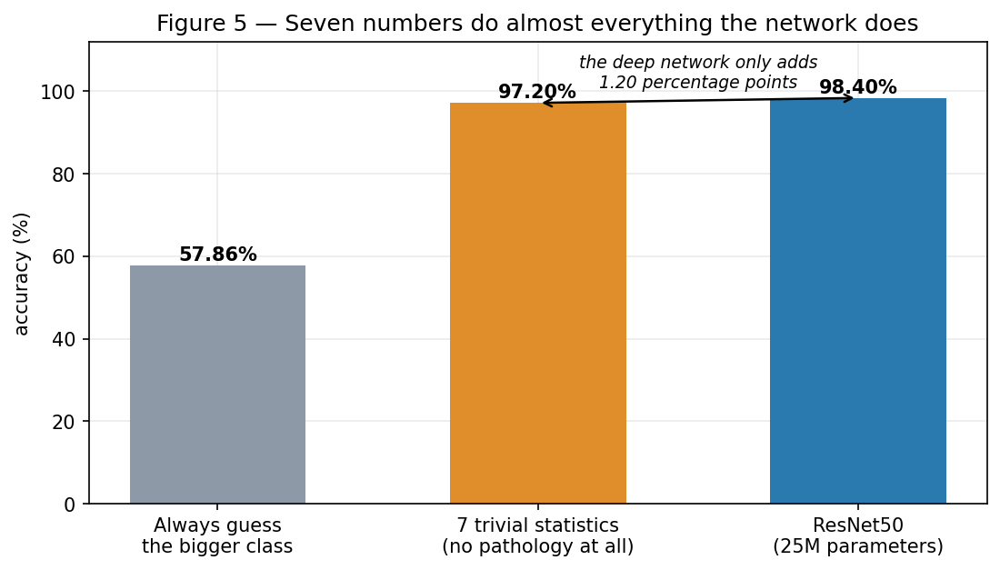{ width=100% }

| What is doing the classifying | On `train/` | On `test/` |
|:---|---:|---:|
| Always guess the bigger class | 57.86% | 54.61% |
| File size alone | 65.78% | **93.70%** |
| Average brightness alone | 87.59% | 46.66% |
| **All seven trivial numbers** | **97.20%** | **96.60%** |
| *ResNet50, 25 million parameters* | *98.40%* | *98.74%* |

Seven numbers — which you can compute without ever opening the image — get within **1.2 points** of a fine-tuned deep network. That is the whole finding of the project in one line.

## 7.2 Why the classes are so easy to tell apart

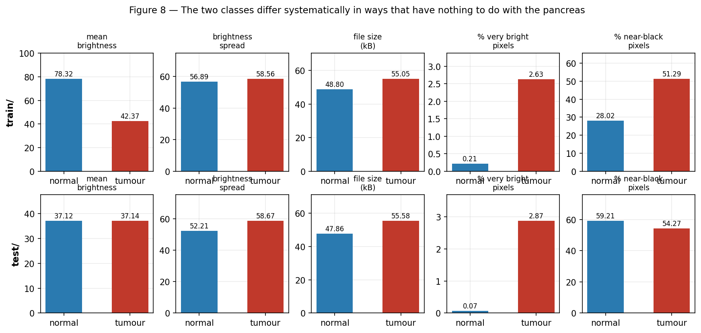{ width=100% }

| Measurement | `train/` normal | `train/` tumour | `test/` normal | `test/` tumour |
|:---|---:|---:|---:|---:|
| Average brightness | 78.32 | 42.37 | 37.12 | 37.14 |
| % of pixels that are very bright | **0.0%** | **3.0%** | **0.0%** | **3.0%** |
| % of pixels nearly black | 28% | 51% | 59% | 54% |
| File size | 48.8 kB | 55.1 kB | 47.9 kB | 55.6 kB |

The very-bright-pixel row is the clearest, and it is identical in both folders: normal images have essentially no bright white pixels, tumour images average 3% of their area in white.

So I looked at the images.

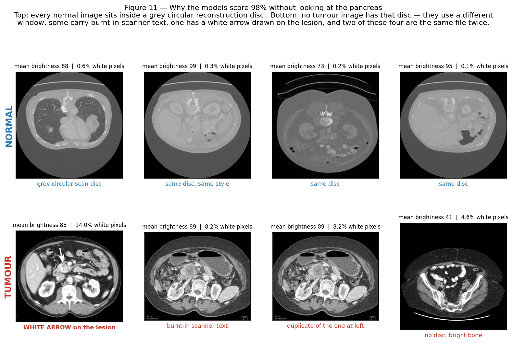{ width=100% }

- **Every normal image** sits inside a **grey circular disc** — the circular region a CT scanner reconstructs, exported with one particular setting.
- **No tumour image has that disc.** They use a different brightness window, they are cropped differently, and their bones show up much whiter.
- Some tumour images carry **burnt-in scanner text** in the corners.
- One tumour image has a **white arrow drawn on it, pointing straight at the lesion**. That single arrow is the brightest thing in the dataset.
- Two of the four tumour images I picked are **the same file twice** — the duplication from Section 6, visible with the naked eye.

The two classes were collected from different places and exported through different pipelines. The network never needed to find a pancreatic tumour. It needed to notice whether the image has a grey disc around it.

## 7.3 The clincher

I then tested all my saved models on the entire 412-image `test/` folder — which the Track A training never touched at all.

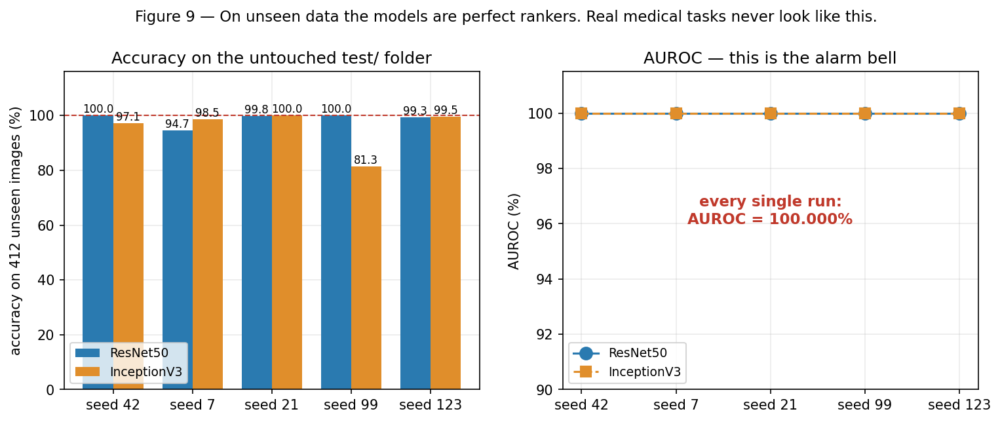{ width=100% }

| Model | Accuracy | Recall | AUROC |
|:---|---:|---:|---:|
| ResNet50 | 98.74 ± 2.06 | **100.00 ± 0.00** | **100.00 ± 0.00** |
| InceptionV3 | 95.29 ± 7.06 | **100.00 ± 0.00** | **100.00 ± 0.00** |

Per seed, on all 412 unseen images:

| Seed | ResNet50 | Acc. | InceptionV3 | Acc. |
|---:|:---|---:|:---|---:|
| 42 | 225 / 0 / 0 / 187 | **100.00%** | 213 / 12 / 0 / 187 | 97.09% |
| 7 | 203 / 22 / 0 / 187 | 94.66% | 219 / 6 / 0 / 187 | 98.54% |
| 21 | 224 / 1 / 0 / 187 | 99.76% | 225 / 0 / 0 / 187 | **100.00%** |
| 99 | 225 / 0 / 0 / 187 | **100.00%** | 148 / 77 / 0 / 187 | **81.31%** |
| 123 | 222 / 3 / 0 / 187 | 99.27% | 223 / 2 / 0 / 187 | 99.51% |

Four things here are alarms, not achievements:

**Three of the ten runs are flawless** — 412 out of 412 unseen images correct. Radiologists disagree with each other on cases like these. Software does not go 412 for 412.

**AUROC is exactly 100.000% in all ten runs.** AUROC asks: does the model rank *every* tumour above *every* healthy scan? A perfect score means the two classes never overlap at all. That does not happen with a real disease. It happens when there is a mechanical giveaway in the picture.

**Recall is exactly 100.00% every single time** — not one missed tumour in 187, ten runs running. Every mistake is a false alarm on a healthy scan.

**Look at InceptionV3, seed 99.** It raises 77 false alarms out of 225 healthy scans — accuracy collapses to 81.31% — and its AUROC is *still* exactly 100%. That combination is only possible if the model separates the two classes perfectly and simply puts its cut-off in the wrong place. A genuinely hard problem cannot fail this way. A giveaway-plus-bad-threshold can, and does.

Finally: removing the 8 images that appear in both folders changes every number by less than 0.1 points. That is not reassurance. It means **the same giveaway is present in both folders**, so `test/` was never really an independent test at all.

---

# 8. What I would do differently

**Audit the data before writing any training code.** All three problems were findable in under five minutes of computing, before I spent a single hour training. Hash the files, check for images filed under two labels, and run the seven-number shortcut test. That is now step one for me, always.

**Never split medical imaging data by slice — split by patient.** If there are no patient IDs, that is a reason to stop and question the dataset, not a detail to work around.

**Collect predictions and labels in the same pass.** The PyTorch scripts avoided the Section 4 bug purely by appending to both lists inside one loop. That makes the entire family of misalignment bugs impossible.

**Report specificity, balanced accuracy and AUROC as standard.** Accuracy alone on an uneven dataset hides too much. AUROC in particular works as an early-warning system: an AUROC of exactly 100% should stop the project until someone explains it.

**Always report a shortcut baseline next to the headline number.** The gap between the deep network and a seven-feature logistic regression is the only part of the score I can honestly attribute to the deep network. Here that gap is 1.2 points.

**Notice the small things.** The flipped class balance between folders. Validation accuracy above 97% after one epoch. Four pipelines at exactly 100.00%. Each one was visible early, and I explained all three away.

**Save every checkpoint.** Everything in Sections 4 to 7 exists because all 20 trained models were on disk. Without them, fixing the bug would have meant retraining from zero.

---

# 9. What should happen next

To actually answer the question I started with, in order:

1. **Get a dataset with patient IDs.** Without them there is no honest split. The Medical Segmentation Decathlon pancreas task and NIH Pancreas-CT are the obvious candidates.
2. **Make sure both classes come from the same source**, with the same brightness window and the same export settings. Remove or paint over any image with an arrow or burnt-in text.
3. **De-duplicate by hash**, and resolve or delete the 18 conflicting labels.
4. **Split by patient**, stratify by class, and publish the split.
5. **Report the shortcut baseline in the same table** as the deep results.
6. **Only then compare architectures** — and use a test set big enough that one image is not worth a full percentage point. My 100-image test set meant every single mistake moved the headline number by 1%.
7. **Finish Track C.** The from-scratch Vision Transformer is written and tested; it just needs to be run.
8. **Add Grad-CAM.** It would produce a picture of *where* each model is looking. My prediction is that it looks at the background, not the pancreas — and that image would settle the argument in one glance.

---

# 10. Everything in the project folder

**Models I trained**

| File | What it does |
|:---|:---|
| `resnet50_train.py`, `inceptionv3_train.py` | Fine-tune ResNet50 / InceptionV3, 5 seeds |
| `mobilevit_train.py`, `swin_transformer_train.py` | Fine-tune MobileViT / Swin-Tiny, 5 seeds |
| `feature_extraction_pipeline.py` | Frozen backbone + 9 classical classifiers |
| `run_all_models.py` | Runs everything |
| `new transformer scratch/` | Transformer and ViT built from scratch, with unit tests |

**Scripts I wrote to find and fix the problems**

| File | What it does |
|:---|:---|
| `reevaluate_fixed.py` | Fixes the shuffle bug; rebuilds each split, verifies it by accuracy fingerprint, recomputes all metrics |
| `reevaluate_pytorch.py` | Independently recomputes MobileViT and Swin from the saved weights |
| `evaluate_external.py` | Tests every saved model on the untouched `test/` folder, with and without the 8 overlapping images |

**Results I generated**

| File | Contents |
|:---|:---|
| `resnet50_results_CORRECTED.csv`, `inceptionv3_results_CORRECTED.csv` | Corrected per-seed metrics |
| `mobilevit_results_RECOMPUTED.csv`, `swin_results_RECOMPUTED.csv` | Independently recomputed per-seed metrics |
| `external_test_results.csv` | External hold-out metrics |
| `figures/fig1` – `fig11` | Every figure in this report |
| `*_outputs/` | 20 trained model checkpoints |
| `outputs_logs/` | Complete training logs |

---

# 11. Closing note

When you find a bug like the one in Section 4, the tempting move is to fix it quietly and report the better number. I want to be clear about why I did not do that here.

Fixing that bug made my results look *better* — ResNet50's κ went from 3.94% to 96.72%. A better number would have made the real problem harder to see, not easier. And the real problem is that this dataset cannot support the claim the project was built to make.

Eleven models, scores from 98% to 100%, and the honest summary is: the networks learned to tell a grey circular background from a black one. Proving that took three checks that between them cost less computing time than a single training run.

I would rather hand in a negative result I can defend line by line than a leaderboard I cannot. The checks in Section 8 are what I will carry into the next project, and they are the part of this internship I expect to still be using in five years.
